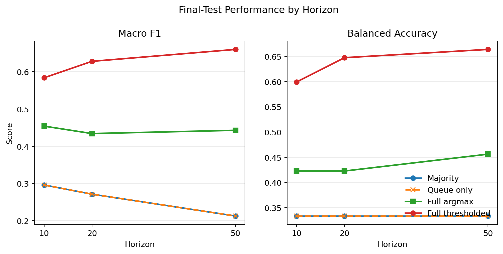
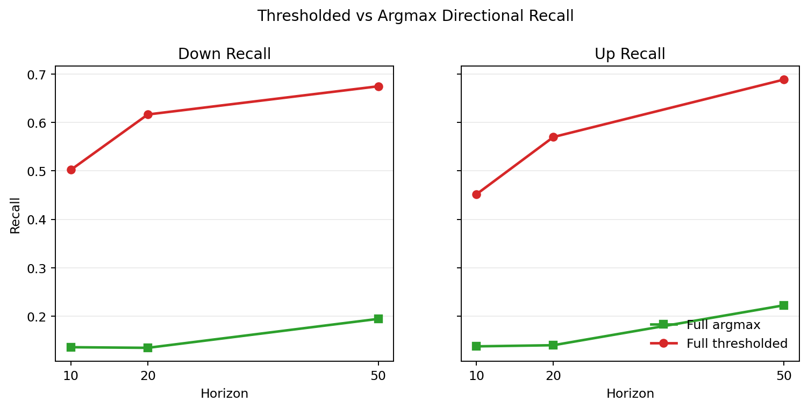
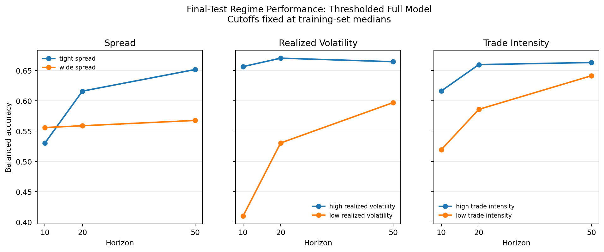
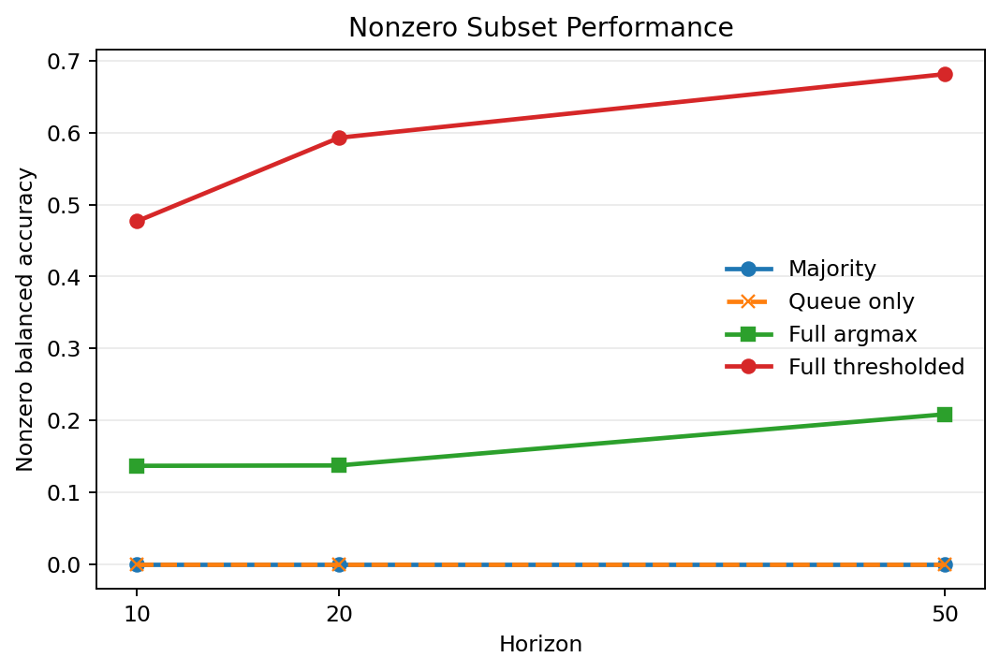

# Current Result Review

This note reviews the frozen seven-day `v3_fixed_window_features` experiment.
It is a statistical signal study on BTCUSDT top-of-book data, not an
execution-aware trading strategy.

## Scope

- Sample: `2024-03-01` to `2024-03-07` UTC.
- Observation: distinct top-of-book quote-state update.
- Targets: ternary midprice direction after 10, 20, and 50 quote-state events.
- Split: chronological 60% train, 20% validation, 20% test.
- Main model: full-feature multinomial logistic regression.
- Secondary operating point: probability thresholds selected on validation
  macro F1 and frozen before test evaluation.

The final test contains 28,715,045 eligible rows and covers approximately
33.6 hours over two UTC dates. Additional feature, threshold, or model-selection
changes require a new experiment.

Event-time targets overlap and adjacent observations are serially dependent. The
row count is therefore not an independent sample size, and this checkpoint does
not attach iid standard errors, p-values, or confidence intervals to the metrics.

## Target Drift

The nonzero-label fraction rises materially from train to validation and remains
elevated in test, especially at longer horizons. At horizon 50 it is 21.4% in
train, 62.6% in validation, and 53.2% in test. Random splitting would mix these
periods and obscure this change in target base rates.

## Horizon Performance

The full-feature model improves final-test macro F1 and balanced accuracy over
both baselines at every horizon. The queue-imbalance-only model ties the
train-majority baseline under these hard-decision metrics. The default argmax
rule remains conservative under class imbalance; validation-selected
thresholding trades some raw accuracy at horizon 10 for substantially higher
class-balanced performance.

At horizon 50, full-model argmax produces macro F1 `0.443` and balanced accuracy
`0.456`. The frozen thresholded operating point reaches macro F1 `0.660` and
balanced accuracy `0.664`.

## Directional Recall

The argmax model assigns useful directional probabilities but often selects the
`unchanged` class. Thresholds selected exclusively on validation recover much
more down/up recall on final test. This is an operating-point result, not a new
model fit, and it should be interpreted alongside the reduced unchanged-class
recall and the horizon-10 accuracy tradeoff.

The two thresholds per horizon were selected from a fixed 15-by-15 grid on one
validation segment. Test labels were not involved in that choice, but the
thresholded result still carries validation-selection uncertainty and is
secondary to the untuned argmax comparison.

## Regime Performance

Each regime cutoff is estimated once from the training split and applied
unchanged to validation and test. At horizon 50, thresholded balanced accuracy is
`0.651` in tight-spread events versus `0.568` in wide-spread events, `0.597` in
zero-volatility events versus `0.664` in positive-volatility events, and `0.641`
at low trade intensity versus `0.663` at high intensity.

The training median of `realized_vol_20` is exactly zero because the feature has
a mass point at zero. That panel therefore compares zero with positive realized
volatility, not two balanced volatility buckets. Regime label composition also
changes sharply, so balanced accuracy is more informative than raw accuracy.
These slices diagnose state dependence within the same short test period; they
do not establish long-run regime stability.

## Supporting Diagnostic

The nonzero subset is secondary because whether a future move will be nonzero is
unknown at prediction time. Conditional on a move, thresholded balanced accuracy
is `0.477`, `0.593`, and `0.681` at horizons 10, 20, and 50 respectively.

## Verification and Claim

The integration verifier independently reconstructed final metrics from
confusion matrices, recombined regime slices, matched compact-prediction
confusions, and confirmed the critical research audit. Maximum numerical
reconstruction error was `1.11e-16`.

Daily metrics cover only a partial March 6 block and one complete March 7 block.
They show no single catastrophic block failure, but two UTC blocks are not enough
to establish temporal stability.

The supported claim is narrow: in this frozen seven-day sample, simple
top-of-book state and recent trade-flow features contain out-of-sample
statistical information about short-horizon event-time midprice direction
relative to majority and queue-imbalance-only baselines.

The result does not establish tradable alpha. The project does not model fees,
latency, queue position, fill probability, market impact, adverse selection, or
executable PnL. A fresh 14-day clean-sample replication is required to assess
whether these findings persist over a longer period.
