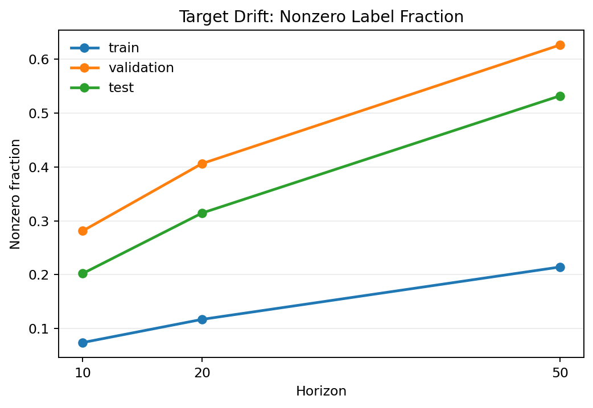
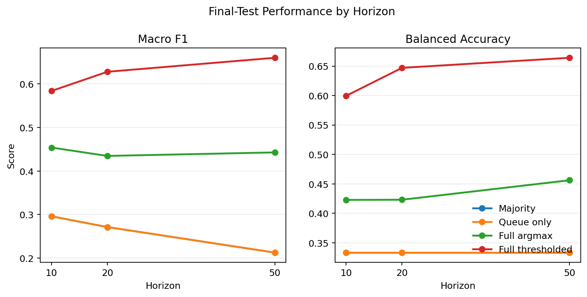
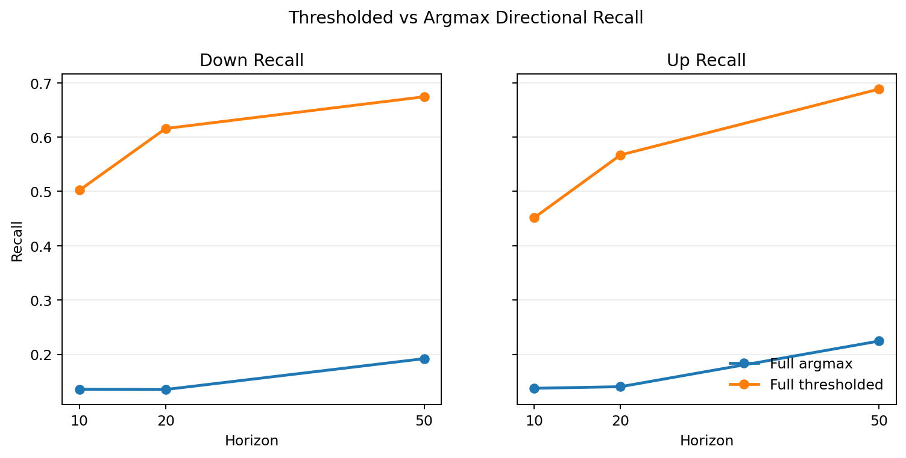
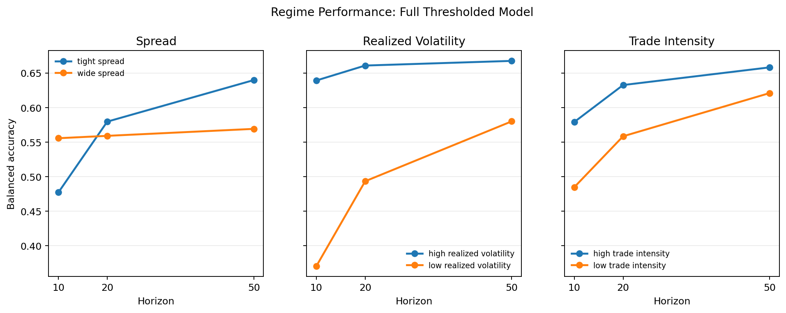
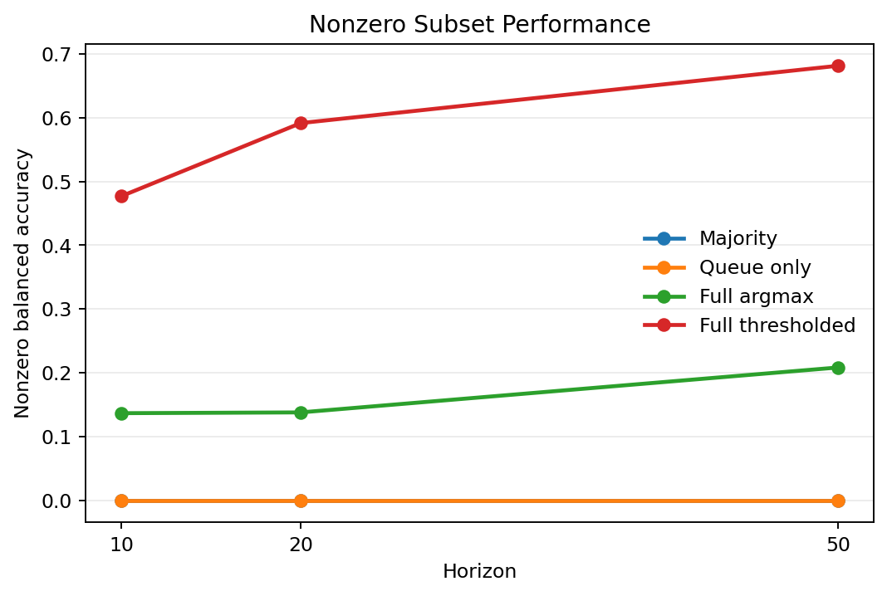

# Current Result Review

This note summarizes the selected plots for the frozen 7-day
`v2_float64_features` checkpoint. The result is a statistical signal test on
BTCUSDT top-of-book data, not an execution-aware trading strategy.

## Scope

- Sample: `2024-03-01` to `2024-03-07` UTC.
- Observation: distinct top-of-book quote-state update.
- Targets: ternary midprice direction after 10, 20, and 50 quote-state events.
- Split: chronological 60% train, 20% validation, 20% test.
- Main model: full-feature multinomial logistic regression.
- Secondary operating point: validation-selected probability thresholding.

The final test set has been evaluated for this checkpoint. Additional feature,
threshold, or model-selection changes belong in a fresh protocol run.

## Target Drift

The validation and test segments contain a much higher fraction of nonzero labels
than the train segment, especially at longer horizons. This is the central
distribution-shift caveat in the current checkpoint. It also explains why random
splits would be misleading: they would mix regimes and hide the change in target
base rates.

## Horizon Performance

The full-feature model improves over both baselines on final-test macro F1 and
balanced accuracy across all three horizons. The queue-imbalance-only model is
close to the majority baseline in this run, so most of the incremental signal is
coming from the broader feature set rather than queue imbalance alone.

The default argmax rule is conservative under class imbalance and often predicts
`unchanged`. The validation-selected thresholded rule sacrifices some
unchanged-class accuracy but produces better macro F1 and balanced accuracy.

## Directional Recall

This plot explains the gap between the argmax and thresholded operating points.
The argmax full model ranks probabilities usefully but does not often cross the
implicit decision boundary for down/up classes. Thresholding, selected only on the
validation split, recovers substantially more directional recall on the final test
split.

## Regime Performance

Regime cutoffs are computed from training-set medians and then applied unchanged
to validation and test. This avoids defining regimes with test-set information.

The thresholded full model is stronger in more active regimes: higher realized
volatility and higher trade intensity generally show better balanced accuracy.
The realized-volatility training median is zero in this sample, so that split is
best read as zero-volatility versus nonzero-volatility rather than two evenly
informative volatility buckets.

## Supporting Diagnostic

The nonzero subset is not the headline task because the production label space is
ternary. It is useful as a diagnostic: conditional on a move occurring, the
thresholded model performs better at longer horizons, with the 50-event horizon
showing the strongest nonzero balanced accuracy in this checkpoint.

## Current Claim

The supported claim is narrow: in this frozen 7-day BTCUSDT sample, simple
top-of-book state and recent trade-flow features contain out-of-sample statistical
information about short-horizon event-time midprice direction relative to majority
and queue-imbalance-only baselines.

The result does not establish tradable alpha. The project does not model fees,
latency, queue position, fill probability, market impact, adverse selection, or
executable PnL. A fresh 14-day clean-sample replication would test whether the
same result survives a longer sample under the same protocol discipline.
